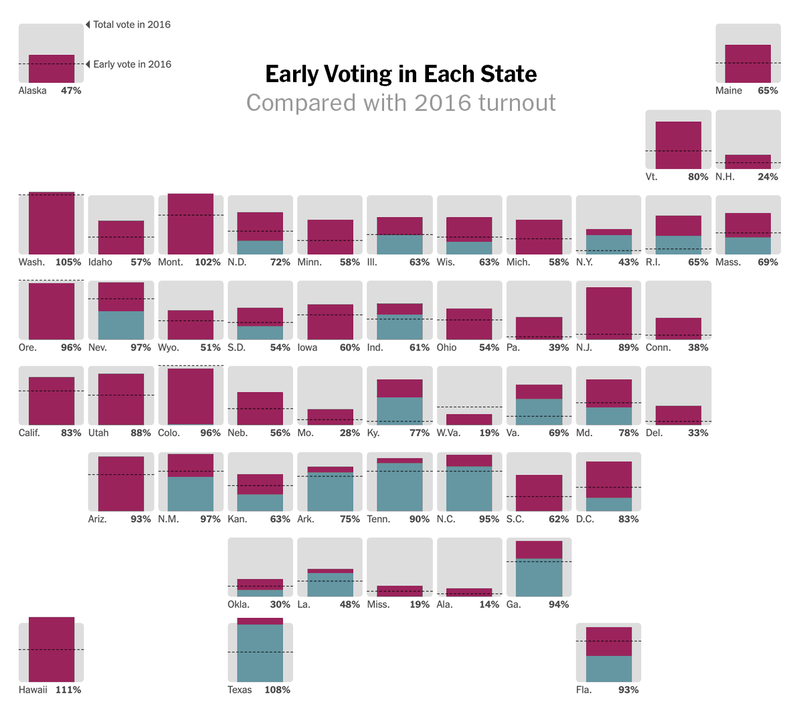

```{r setup, include=FALSE}
knitr::opts_chunk$set(echo = FALSE)
```

## geo_grid를 활용한 시각화

### 멋드러진 해외의 선거 시각화

{width="400"}

{width="400"}

해외 언론에서 선거 결과를 시각화한 기사를 볼 때마다 드는 생각이 있습니다. "아 우리나라도 저렇게 격자형태로 시각화하면 멋드러지지 않을까..." 국내에서는 시군구 혹은 읍면동 단위로 색을 칠하는 형태가 대부분이지 그 안에 그래프를 넣어서 시각화하기가 힘들어요. 미국은 50개 주에 1개의 특별구로 이루어졌으니, 필요한 격자는 51개 뿐이지만 우리나라의 시군구는 250개. 큰 권역 구분 정도는 다양한 시각화를 시도할 수 있지만 시군구 단위로 하기엔 부담이 될 수 있는거죠.

### geofacet package

{width="55%"}

그래도 해보고 싶습니다. 우리나라도 시군구 단위로 멋드러지게 만들고 싶어요. 그래서(!) 시군구 단위 그리드 만들어 봤습니다. 활용한 패키지는 [geofacet](https://hafen.github.io/geofacet/)입니다. geofacet은 말 그대로 지리적 정보(geo)로 면(facet)을 분할해 볼 수 있는 패키지인데요, 이 패키지가 좋은 건 Grid Designer라는 기능을 통해 자기만의 그리드를 만들 수 있다는 거죠. 그래서 지도를 펼치고 250개 시군구의 위치를 하나하나 지정해가며 만들어 봤습니다. geofacet package에도 제출해 놓았습니다. [여기에서](https://github.com/hafen/geofacet/issues/358) 확인할 수 있어요.

```{r}
library(readr)
mygrid <- read_csv("kr_sgg.csv", col_types = cols(code = col_character()))

head(mygrid[,c(1,3,4,2)])
```

만들어 놓은 대한민국 시군구 단위 그리드 구조는 아주 간단합니다. 이름, row, col, code 정도로 이루어져 있죠. geofacet 함수는 그리드의 행(row)과 열(col)을 인식해서 그 모양에 맞춰 facet해 주는 구조입니다. 이 그리드를 가지고 그려보면 이런 모양이 나옵니다.

``` r
geofacet::grid_preview(mygrid)
```

```{r, fig.width=7, fig.height=10}
geofacet::grid_preview(mygrid)
```

짜잔\~ 면적이 서로 다른 시군구를 동일한 면적 단위로 표현했기때문에 실제 위치와는 차이가 있을 수 있습니다. 시군구 그리드에 적용된 코드는 행정안전부에서 제공하고 있는 행정표준코드를 따라서 만들어 놓았습니다. 종로구(11110), 중구(11140) 이런식으로 말이죠. 시군구 단위의 여러 데이터들을 합쳐서 시각화, 분석할 일 있으면 행정코드 기준으로 정리한다면 간단하게 할 수 있을 겁니다.

<br/>

## geo_grid + ggplot

### 선거 데이터 만들기

이제 여기에 해야할 것은 각각의 시군구에 그래프를 넣어보는 겁니다. 이번 대통령 선거 득표 정보를 바탕으로 그래프를 넣어보려고 해요. 선관위 개표 데이터를 정리해서 다음과 같은 데이터(PE_20)를 만들어 봤습니다. PE_20 데이터는 [여기에서](https://github.com/hafen/geofacet/issues/358) 다운받을 수 있습니다.

``` r
head(PE_20)
```

```{r}
library(readxl)
library(tibble)

PE_20 <- read_excel("Presidential_Election_2022.xlsx")
PE_20 <- as.tibble(PE_20)

head(PE_20)
```

PE_20 데이터에는 각 시군구 단위로 후보별 득표수를 넣어 두었습니다. 시군구별 선거인수, 후보별 득표수, 무효투표수, 기권수 등... 이 데이터로 시각화를 바로 할 순 없습니다. 우리에게 필요한 건 각 후보별 득표율이니까, 조금 더 정제할 필요가 있죠. 일단 득표율 TOP3 후보의 득표율을 계산해보겠습니다. 득표율은 후보별 투표수를 전체 투표수 - 무효투표수로 나누면 됩니다.

``` r
library(dplyr)

PE_20 <- PE_20 %>% mutate(이재명R = 이재명 / (투표수 - 무효투표수),
                          윤석열R = 윤석열 / (투표수 - 무효투표수),
                          심상정R = 심상정 / (투표수 - 무효투표수))

PE_20_rate <- PE_20 %>% select(c(code, 이재명R, 윤석열R, 심상정R, 구분, 시군구명))
head(PE_20_rate)
```

```{r}
library(dplyr)

PE_20 <- PE_20 %>% mutate(이재명R = 이재명 / (투표수 - 무효투표수),
                          윤석열R = 윤석열 / (투표수 - 무효투표수),
                          심상정R = 심상정 / (투표수 - 무효투표수))

PE_20_rate <- PE_20 %>% select(c(code, 이재명R, 윤석열R, 심상정R, 구분, 시군구명))
head(PE_20_rate)
```

제대로 계산되었는지 비교해봅시다. 선관위 홈페이지에서 살펴보면 종로구에서 3명의 후보의 득표율이 46.42%, 49.48%, 3.13%였고, 중구에서의 득표율이 각각 45.42%, 50.96%, 2.74% 군요. 계산된 것과 비교해보니 맞는것 같습니다. 계산된 데이터는 wide form인데 시각화를 위해선 long form으로 조정할 필요가 있어요.

### long form 으로 만들기

long form으로 바꾸는 법은 여러가지가 있지만 여기선 2개를 소개해드리겠습니다. 먼저 tidyr 패키지의 gather 함수. gather 함수가 직관적이지 않다면 그 대안으로 나온 pivot_longer를 사용하는 것도 방법입니다. 두 함수의 결과는 같으니까 원하는 것 사용하면 될 겁니다. tidyr 패키지 제작자인 해들리 위컴은 새로 나온 pivot_longer함수를 추천하고 있어요.

``` r
library(tidyr)

PE_20_final <- PE_20_rate %>% gather(key = "후보", value = "득표율", 이재명R, 윤석열R, 심상정R)

# key: long form 데이터로 바꾸었을 때 이름이 될 칼럼명
# value: long form 데이터로 바꾸었을 때 값이 들어갈 칼럼명
# PE_20_rate의 칼럼 중 후보별 득표율 칼럼 3개(이재명R, 윤석열R, 심상정R)를 써주면 됩니다.


PE_20_final <- PE_20_rate %>% pivot_longer(cols = ends_with("R"), 
                                           names_to = "후보",
                                           values_to = "득표율")

# cols: long form 데이터로 바꾸고 싶은 칼럼들(이재명R, 윤석열R, 심상정R)
# ends_with: 동일한 단어로 끝나는 애들만 고를 때 사용하는 함수(tidyselect package의 함수)
# names_to : long form 데이터로 바꾸었을 때 이R, 윤R, 심R이 들어갈 칼럼 이름
# values_to : long form 데이터로 바꾸었을 때 value 값에 들어갈 칼럼 이름
```

```{r}
library(dplyr)
library(tidyr)

PE_20_final <- PE_20_rate %>% gather(key = "후보", value = "득표율", 이재명R, 윤석열R, 심상정R)
head(PE_20_final)

PE_20_final2 <- PE_20_rate %>% pivot_longer(cols = ends_with("R"), 
                                           names_to = "후보",
                                           values_to = "득표율")

head(PE_20_final2)
```

### ggplot 그래프 그리기

데이터도 정리가 되었겠다... 이제 이것을 가지고 그래프로 그려서 그리드에 넣으면 끝입니다. 일단 후보별 득표율을 가지고 지역별로 들어갈 바 차트가 어떤 모양이 될지, 샘플을 만들어보겠습니다. 서울특별시 종로구(code = 11110)를 가지고 예시로 그려봅시다.

``` r
PE_20_final$후보 <- factor(PE_20_final$후보, levels = c("심상정R", "윤석열R", "이재명R"))

data_11110 <- PE_20_final %>% filter(code == 11110)

ggplot(data_11110, aes(x = 후보, y = 득표율, fill = 후보)) +
  geom_col() +
  coord_flip() +
  scale_fill_manual(values = c("#F7EF99", "#fc7b84", "#008EC6")) +
  theme_chichead()
  
# 그래프를 그렸을 때 기호순으로 나열될 수 있도록 factor level을 부여해줍니다.
# coord_flip()를 사용하면 후보의 순서가 뒤집어지기때문에 factor level은 역순으로.
# 각 후보에 맞춰서 컬러 팔레트 설정해줍니다.
# 잡다구리한 요소들을 다 뺀 chichead만의 테마를 만들어 적용합니다.
```

```{r}
library(tidyverse)
library(showtext)

font_add("BM", "/Users/hm/R_study/R_Visual/font/BMYEONSUNG.ttf")
font_add("Cinema_T", "/Users/hm/R_study/R_Visual/font/aCinemaB.ttf")
font_add("Cinema_C", "/Users/hm/R_study/R_Visual/font/aCinemaM.ttf")
font_add("XKCD", "/Users/hm/R_study/R_Visual/font/xkcd-Regular.otf")
font_add("Lato", "/Users/hm/R_study/R_Visual/font/Lato-Regular.ttf")
font_add("Noto_B", "/Users/hm/R_study/R_Visual/font/NotoSansKR-Bold.otf")
font_add("Noto_M", "/Users/hm/R_study/R_Visual/font/NotoSansKR-Medium.otf")
font_add("Noto_R", "/Users/hm/R_study/R_Visual/font/NotoSansKR-Regular.otf")
font_add("NanumBP_R", "/Users/hm/R_study/R_Visual/font/NanumBarunpenR.ttf")
font_add("NanumBP_B", "/Users/hm/R_study/R_Visual/font/NanumBarunpenB.ttf")
font_add("DIN", "/Users/hm/R_study/R_Visual/font/D-DIN.otf")
font_add("DIN_B", "/Users/hm/R_study/R_Visual/font/DIN Bold.otf")

showtext_auto()

mabunews_style <- function() {
  ggplot2::theme(
    plot.caption = element_blank(),
    #마부뉴스때는 배경 하얀색으로 가자
    #plot.background = element_rect(fill = "#f0f0f0", color = "#f0f0f0"),
    #plot.background = element_rect(fill = "#fafafa", color = "#fafafa"), # 이게 디폴트
    plot.background = element_rect(fill = "white", color = "white"),
    plot.margin = margin(10, 5.5, 10, 5.5),
    
    # 타이틀도 영어면 DIN 쓴다
    #plot.title = element_text(family = "DIN_B", size = 15), 
    #plot.subtitle = element_text(family = "DIN", size = 12),
    plot.title = element_text(family = "Noto_M", size = 15), 
    plot.subtitle = element_text(family = "Noto_R", size = 12),
    
  
    axis.title = element_blank(), 
    axis.text = element_text(family = "Noto_R", size = 10, color = "#222222"), 
    axis.ticks = element_line(color = "#dfdfe0"),

    
    # tick 여부에 따라 왔다갔다
    #axis.ticks.x = element_blank(),
    axis.line = element_blank(), 
    panel.grid.minor = element_blank(), 
    #panel.grid.major.y = element_blank(), 
    panel.grid.major.y = element_line(color = "#dfdfe0"), 
    panel.grid.major.x = element_blank(), 
    panel.background = element_blank(), 
    strip.background = element_rect(fill = "#e4e6e8"), 
    #strip.text = element_text(size = 12, hjust = 0),
    strip.text = element_text(size = 12, family = "Noto_R", colour = "black"),
    

    # 축 항목이 숫자인경우에는 DIN / 아니면 Noto_R으로 할것 -> 숫자로만 축을 구성하고 단위는 우상단에 위치?
    axis.text.x = element_text(family = "DIN", colour = "black", size = 10),
    axis.text.y = element_text(family = "Noto_R", colour = "black", size = 10),
    #axis.text.x = element_blank(),
    #axis.text.y = element_blank(),

    axis.title.x = element_blank(),
    axis.title.y = element_blank(),
    
    legend.position = "bottom", #none, top, bottom, right, left, c(x, y)
    legend.direction = "horizontal",
    legend.title = element_text(family = "Noto_R", size = 8), #element_blank(),
    legend.text = element_text(family = "Noto_R", size = 8),
    #legend.key = element_rect(fill = "#fafafa", colour = "#fafafa"),
    #legend.background = element_rect(fill = "#fafafa")
    legend.key = element_rect(fill = "white", colour = "white"),
    legend.background = element_rect(fill = "white")
  )
}

PE_20_final$후보 <- factor(PE_20_final$후보, levels = c("심상정R", "윤석열R", "이재명R"))

data_11110 <- PE_20_final %>% filter(code == 11110)

ggplot(data_11110, aes(x = 후보, y = 득표율, fill = 후보)) +
  geom_col() +
  coord_flip() +
  scale_fill_manual(values = c("#F7EF99", "#fc7b84", "#008EC6")) +
  mabunews_style() 
```

### 최종 시각화

이제 이 그래프를 250개 시군구에 넣으면 됩니다. 어떻게? geofacet::facet_geo 함수를 쓰면 단 한 줄이면 만들 수 있습니다. 전국 지도에서 3위 후보의 득표율이 보이질 않으니... 일단 제외하고 1, 2위 후보만 시각화를 해 보겠습니다.

``` r
library(geofacet)

ggplot(subset(PE_20_final, 후보 != "심상정R"), aes(x = 후보, y = 득표율, fill = 후보)) +
  geom_col() +
  coord_flip() +
  scale_fill_manual(values = c("#fc7b84", "#008EC6")) +
  facet_geo(~ code, grid = mygrid) +
  theme_chichead() +
  theme(
    strip.background = element_blank(),
    strip.text.x = element_blank(),
    axis.text.y = element_blank()
  ) + 
  scale_y_continuous(breaks = c(.5, 1), limits = c(0, 1))
  
# 위의 코드에서 추가된 건 facet_geo()뿐
# 만들어 놓은 그리드(mygrid)와 join할 데이터(code)를 입력하면 끝
# 시각화 정리는 theme에서 약간의 조정으로 마무리
```

```{r, fig.width=7, fig.height=10}
library(geofacet)

ggplot(subset(PE_20_final, 후보 != "심상정R"), aes(x = 후보, y = 득표율, fill = 후보)) +
  geom_col() +
  coord_flip() +
  scale_fill_manual(values = c("#fc7b84", "#008EC6")) +
  facet_geo(~ code, grid = mygrid) +
  mabunews_style() +
  theme(
    strip.background = element_blank(),
    strip.text.x = element_blank(),
    axis.text.y = element_blank()
  ) + 
  scale_y_continuous(breaks = c(.5, 1), limits = c(0, 1))
```

짜잔! 이러면 우리가 원했던 250개 시군구 그리드에 각각의 후보별 득표율을 그릴수 있게 되었습니다.
